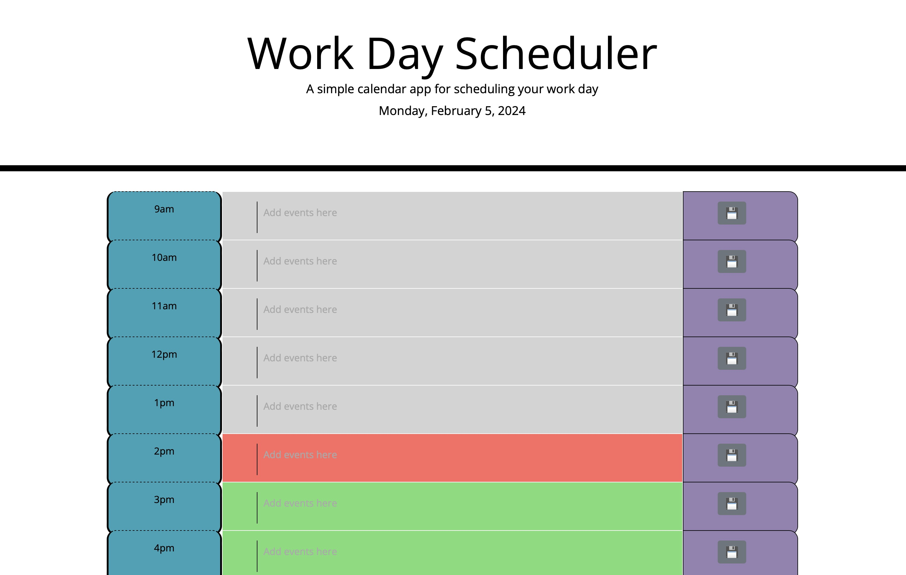
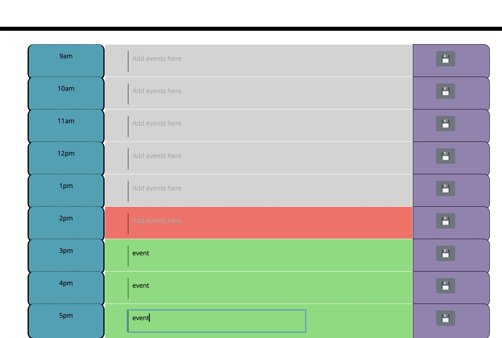

# Module & Challenge Third-Party APIs: Daily Planner App

The module has been a good change in direction from the last few modules. I found this module a lot more fun and practical to code. I have again googled and looked at other code from other websites to recreate the deserved look.

## Resources

These are some of the resources I used for the challenge.

https://www.w3schools.com/

https://codepen.io/

https://stackoverflow.com/ 

## Links to Application
https://github.com/iamdanjoyce/module-seven-planner

https://iamdanjoyce.github.io/module-seven-planner/

## Screenshots of Application Live
 
 